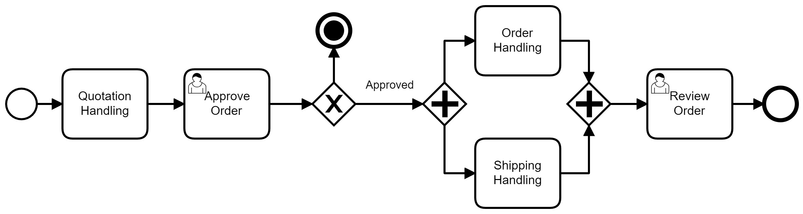

### 3.3.1 Processo 1 – Controle de Temperatura da farmácia

_Apresenta o controle de temperatura na farmácia com foco em oportunidades de melhoria para reduzir o uso de papel, minimizar erros manuais e melhorar a organização dos registros.  
Na versão atual (AS-IS), o processo é realizado por meio de formulário impresso, com riscos de retrabalho e dificuldades na armazenagem e correções.  
Na proposta (TO-BE), o registro passa a ser digital, utilizando, uma planilha do Excel por exemplo, permitindo correções imediatas, assinatura digital pelos farmacêuticos e armazenamento seguro e sustentável dos registros._

#### Detalhamento das atividades

_Esta seção descreve, de forma detalhada, as propriedades das atividades relacionadas ao controle de temperatura, conforme os modelos AS-IS e TO-BE apresentados anteriormente._

Os tipos de dados a serem utilizados são:

* **Área de texto** - campo texto de múltiplas linhas  
* **Caixa de texto** - campo texto de uma linha  
* **Número** - campo numérico  
* **Data** - campo do tipo data (dd-mm-aaaa)  
* **Hora** - campo do tipo hora (hh:mm:ss)  
* **Data e Hora** - campo do tipo data e hora (dd-mm-aaaa, hh:mm:ss)  
* **Imagem** - campo contendo uma imagem  
* **Seleção única** - campo com várias opções de valores que são mutuamente exclusivas (radio button ou combobox)  
* **Seleção múltipla** - campo com várias opções que podem ser selecionadas (checkbox ou listbox)  
* **Arquivo** - campo de upload de documento  
* **Link** - campo que armazena uma URL  
* **Tabela** - campo formado por uma matriz de valores  

---

**Atividade 1: Registro da Temperatura**

_Descrição: Nesta atividade, o funcionário efetua o registro da temperatura na farmácia.  
- **Versão AS-IS:** O funcionário imprime a folha de controle, verifica a temperatura, preenche o formulário à mão, e, em caso de erro, precisa refazer o registro.  
- **Versão TO-BE:** O funcionário utiliza um arquivo do Excel ou similar para registrar a temperatura diretamente de forma digital, permitindo correção imediata sem a necessidade de reimpressão e facilitando backups._

| **Campo**           | **Tipo**         | **Restrições**                                  | **Valor default** |
|---------------------|------------------|-------------------------------------------------|-------------------|
| temperatura         | Número           | Precisão de 0.1°C; intervalo de 0 a 50°C          |                   |
| data_registro       | Data             | Formato dd-mm-aaaa                              |                   |
| horario_registro    | Hora             | Formato hh:mm:ss                                |                   |

| **Comandos**  | **Destino**                              | **Tipo**  |
|---------------|------------------------------------------|-----------|
| corrigir      | Revisão da temperatura (se houver erro)  | default   |
| enviar        | Atividade 2 – Aprovação e Assinatura       | default   |

---

**Atividade 2: Aprovação e Assinatura Digital**

_Descrição: Esta etapa envolve o farmacêutico, que revê as informações registradas e, se estiverem corretas, realiza a assinatura digital.  
- **Versão AS-IS:** O farmacêutico assina manualmente o formulário impresso e o envia para o setor fiscal, o que pode envolver retrabalho se houver erros.  
- **Versão TO-BE:** A assinatura digital é feita no próprio arquivo (por exemplo, por meio de um PDF ou sistema integrado), permitindo um processo mais ágil e seguro, além de facilitar o arquivamento e controle para fins fiscais._

| **Campo**          | **Tipo**         | **Restrições**                                          | **Valor default**    |
|--------------------|------------------|---------------------------------------------------------|----------------------|
| assinatura         | Arquivo / Imagem | Assinatura digital em formato PDF ou imagem             |                      |
| status_aprovacao   | Seleção única    | Opções: Aprovado, Rejeitado                             | Aprovado (default)   |

| **Comandos**  | **Destino**                              | **Tipo**  |
|---------------|------------------------------------------|-----------|
| aprovar       | Envio para o setor fiscal                | default   |
| rejeitar      | Retorno para correção do registro        | cancel    |

---

_Observações:_  
- **Sustentabilidade:** A transição do uso de papel para o digital contribui para práticas ambientais responsáveis.  
- **Melhoria na Organização:** O armazenamento digital com backup reduz riscos administrativos e facilita a recuperação das informações quando necessário.  
- **Correção e Eficiência:** O processo digital permite correções dinâmicas sem a necessidade de reimprimir formulários, aumentando a eficiência operacional.

